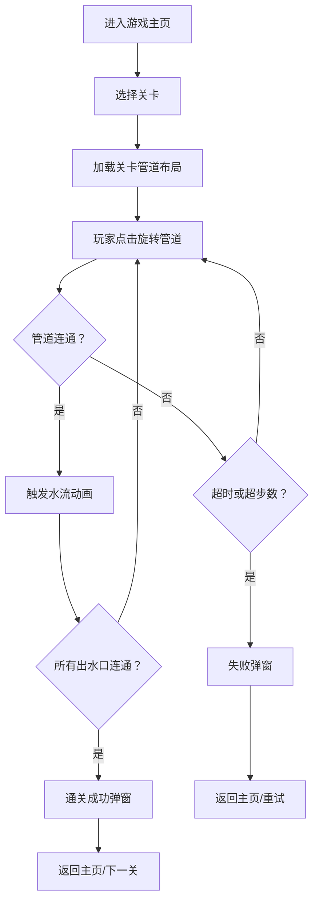

## 1. 产品概述

管道连接工程师是一款益智休闲网页小游戏，玩家需要通过旋转网格中的各种管道，将水源与所有出水口连通起来。

- 目标用户：休闲益智游戏爱好者，所有年龄段
- 产品价值：锻炼空间思维和逻辑推理能力，提供轻松有趣的挑战体验

## 2. 核心功能

### 2.1 用户角色
| 角色 | 注册方式 | 核心权限 |
|------|----------|----------|
| 玩家 | 无需注册 | 选择关卡、旋转管道、查看游戏状态 |

### 2.2 功能模块
1. **游戏主页**：标题、关卡选择、游戏规则说明
2. **游戏关卡页**：管道网格、计时器、步数统计、水流动画、通关/失败提示

### 2.3 页面详情
| 页面名称 | 模块名称 | 功能描述 |
|----------|----------|----------|
| 游戏主页 | 标题区 | 游戏标题、副标题、开始按钮 |
| 游戏主页 | 关卡选择 | 显示已解锁关卡，点击进入对应关卡 |
| 游戏主页 | 游戏规则 | 简要说明玩法和目标 |
| 游戏关卡页 | 管道网格 | 显示管道布局，点击旋转管道，水流动画播放 |
| 游戏关卡页 | 状态面板 | 显示当前关卡、剩余时间、已用步数、步数限制 |
| 游戏关卡页 | 操作栏 | 重置关卡、返回主页按钮 |
| 游戏关卡页 | 结果弹窗 | 显示通关/失败信息及下一步操作 |

## 3. 核心流程

玩家从主页选择关卡进入游戏，在限定时间和步数内通过点击旋转管道使水流从水源流经连通的管道到达所有出水口。水流连通即通关，超时或步数用尽则失败。

## 4. 用户界面设计

### 4.1 设计风格
- **主色调**：深青蓝色 (#0f172a) 作为背景，金属质感的管道，流动的亮蓝色水流 (#38bdf8)
- **辅助色**：温暖的琥珀色 (#f59e0b) 用于水源和出水口标记，绿色 (#10b981) 表示通关
- **按钮风格**：圆角矩形，带有渐变和阴影，悬停时有微动画
- **字体**：使用 Orbitron 作为标题字体（科技感），Inter 作为正文字体
- **布局风格**：卡片式布局，居中游戏网格，顶部状态栏
- **整体风格**：工业/蒸汽朋克风格，深色背景配合发光效果，营造工程师工作场景

### 4.2 页面设计概述
| 页面名称 | 模块名称 | UI 元素 |
|----------|----------|----------|
| 游戏主页 | 标题区 | 大字号发光标题、装饰性管道图案、脉冲动画按钮 |
| 游戏主页 | 关卡选择 | 卡片式关卡列表，显示关卡编号、难度星级、通关状态 |
| 游戏主页 | 游戏规则 | 图标+文字说明，简洁明了 |
| 游戏关卡页 | 管道网格 | 正方形网格，每格可点击旋转，金属质感管道 SVG 渲染 |
| 游戏关卡页 | 状态面板 | 水平排列的状态卡片，数字使用等宽字体 |
| 游戏关卡页 | 操作栏 | 图标按钮，悬停放大效果 |
| 游戏关卡页 | 结果弹窗 | 半透明遮罩 + 居中卡片，带按钮交互动画 |

### 4.3 响应式设计
- 桌面端优先设计，自适应移动端
- 移动端：管道网格按屏幕宽度缩放，状态栏改为垂直排列
- 触摸优化：管道格子点击区域增大

### 4.4 动画设计
- 管道旋转：90° 平滑旋转动画（0.3s ease-out）
- 水流流动：蓝色流光沿管道路径动画（脉冲+渐变流动）
- 通关效果：管道依次发光，粒子飘散效果
- 页面切换：淡入淡出过渡
