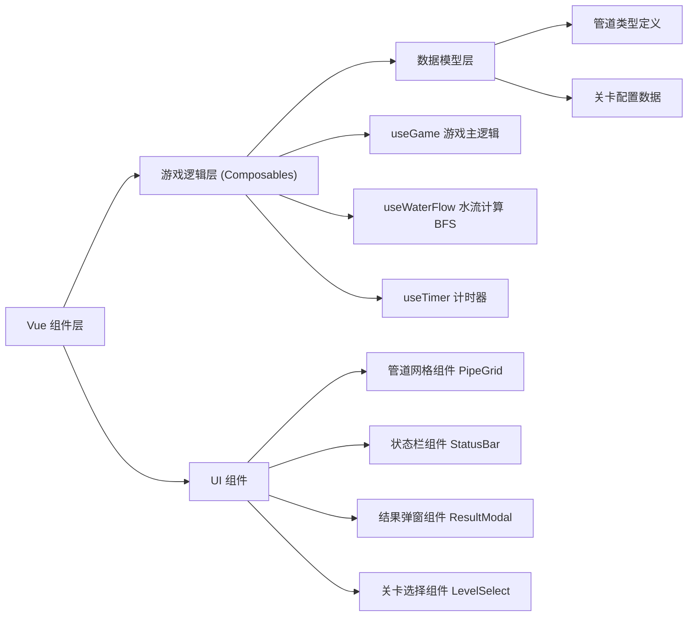
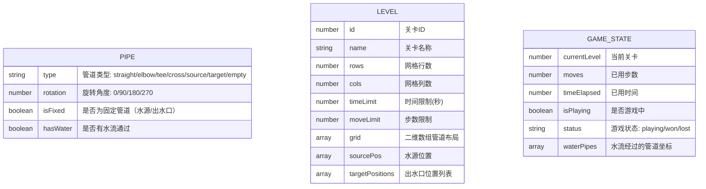

## 1. 架构设计



## 2. 技术描述

- **前端**：Vue 3 + TypeScript + Vite + Tailwind CSS 3
- **初始化工具**：vite-init
- **后端**：无（纯前端游戏）
- **数据库**：无（关卡数据内置，游戏进度存 LocalStorage）

## 3. 路由定义

| 路由 | 用途 |
|------|------|
| / | 游戏主页（关卡选择） |
| /game/:levelId | 游戏关卡页 |

## 4. 数据模型

### 4.1 数据模型定义



### 4.2 核心数据结构

```typescript
// 管道连接方向（上、右、下、左）
type Direction = 'top' | 'right' | 'bottom' | 'left'

// 管道类型
type PipeType = 'empty' | 'straight' | 'elbow' | 'tee' | 'cross' | 'source' | 'target'

interface PipeCell {
  type: PipeType
  rotation: 0 | 90 | 180 | 270
  isFixed: boolean
  hasWater: boolean
}

interface Level {
  id: number
  name: string
  rows: number
  cols: number
  timeLimit: number
  moveLimit: number
  grid: PipeCell[][]
  sourcePos: { row: number; col: number }
  targetPositions: { row: number; col: number }[]
}
```

### 4.3 管道连接方向定义

每种管道类型在 rotation=0 时的连接方向：
- **straight (直管)**：连接 top 和 bottom
- **elbow (弯管)**：连接 top 和 right
- **tee (三通)**：连接 top、right、bottom
- **cross (十字)**：连接 top、right、bottom、left
- **source (水源)**：连接 right（可配置）
- **target (出水口)**：连接 left（可配置）

## 5. 核心算法：BFS 水流计算

1. 从水源位置开始，将水源加入 BFS 队列
2. 对队列中的每个格子，根据管道类型和旋转角度计算其连接方向
3. 检查每个连接方向的相邻格子：
   - 判断相邻格子是否在网格范围内
   - 判断相邻格子的管道是否有反向连接（即互相连通）
4. 若连通且未被访问过，标记为有水流，加入队列
5. 遍历完成后，检查所有出水口是否都被标记为有水流
6. 使用动画按 BFS 顺序依次播放水流效果
